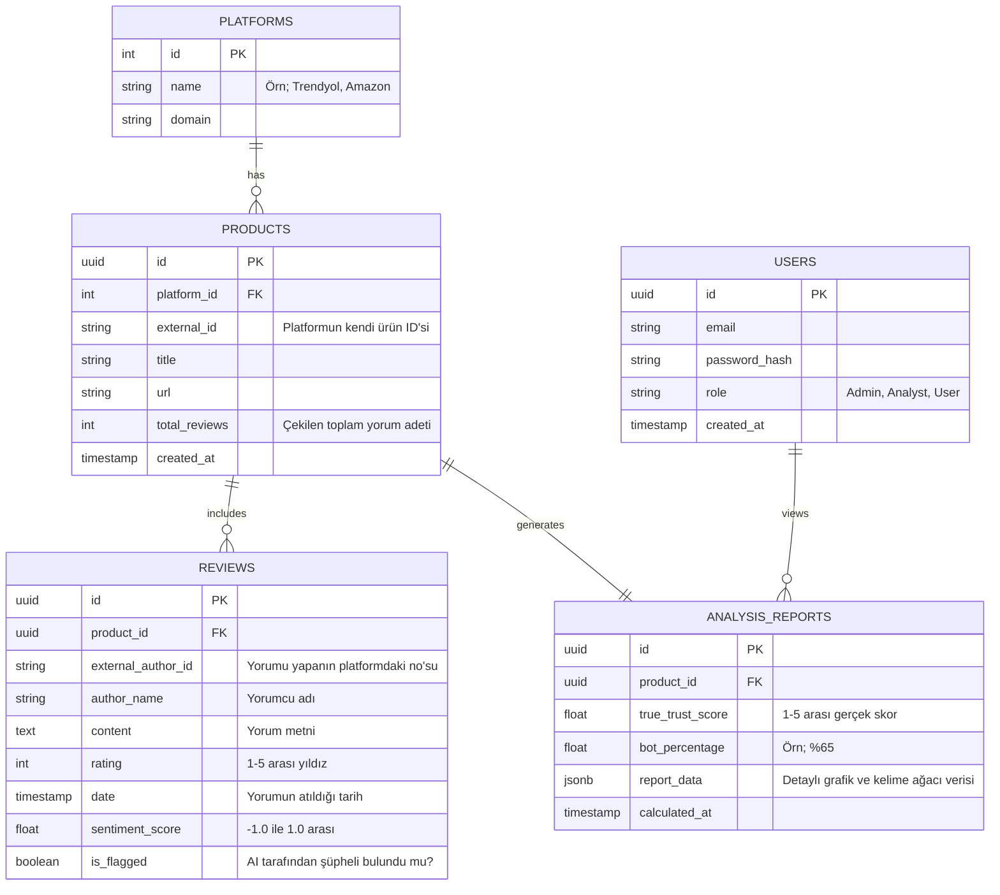

# PostgreSQL Veritabanı Şeması

Decepta AI uygulamasının ana veri omurgası (SOT - Source of Truth) PostgreSQL'dir. Kullanıcılar, ürünler ve NLP tarafında duygu analizi tamamlanan yorumların kayıtları burada tutulur.

## Varlık İlişki Diyagramı (ERD)

Aşağıdaki şema, sistemde tuttuğumuz ana tabloları ve birbirleriyle olan PK/FK (Primary Key / Foreign Key) bağlarını göstermektedir.

## Tablo Detayları

1. **`USERS`:** B2B web panelini kullanan analistlerin ve B2C mobil uygulamayı kullanan tüketicilerin giriş bilgilerini tutar.
2. **`PLATFORMS`:** Desteklenen e-ticaret siteleri. İleride yeni bir site (Örneğin: Hepsiburada) eklendiğinde buraya dahil edilecektir.
3. **`PRODUCTS`:** Analiz için sisteme linki girilen ürünlerin üst verisi (meta-data). Ayn ürün tekrar sorgulanırsa veritabanından getirilir.
4. **`REVIEWS`:** NLP (Doğal Dil İşleme) motorumuzun sonuçlarını (`sentiment_score`, `is_flagged`) sakladığımız asıl kritik tablo.
5. **`ANALYSIS_REPORTS`:** NLP ve Graph DB'den gelen sonuçların harmanlanıp JSON formatında mobil ve web arayüzüne gönderilmek üzere "Önbelleklendiği (Cached)" tablodur.
